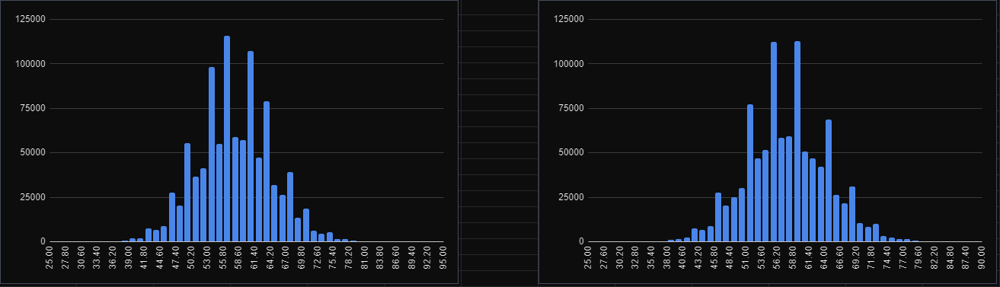

# Graveler rng

Written specifically as an example of generating 1 billion dice rolls and counting how many of them were 1, and if that is ever enough paralysis procs to complete Pikasprey's softlock 
ShoddyCast video: [@Pikasprey's Graveler Soft Lock is INSANE | The SCIENCE of Soft Lock Picking Pokemon - YouTube](https://www.youtube.com/watch?v=M8C8dHQE2Ro) 

Random numbers are generated on the GPU, however we're only interested in the highest number of 1s rolled, so inside a workgroup (a series of gpu threads which can talk) each thread runs it's own dice session, it then takes the maximum number of 1s in the workgroup, and then each workgroup writes back to the CPU it's highest 1 count, then the CPU takes the max of those, which is reported back to the user 

See problems section for more info

## Usage

```
Graveler random number generator
    --help/-h : print this help message
    -r [val] : run multiplier, how many times do you want to repeat a billion runs
    -v : try enable vulkan api validation
    -w : write highest number of 1s rolled per workgroup
```

## Build

Need Vulkan SDK incl Volk, Windows Visual studio, CMake v25+

```bash
mkdir build
cmake -S . -B build
cmake --build build --config=Release
cmake --install build --prefix .
```

## Problems

Designed to run specifically around my RTX 3060TI, workgroup packings might not be as efficient on other hardware 

Pseudorandom generation in my code is not very good. I'm not a statistician so I'm not 100% sure of the causes. However the distributions of how often each number of 1s appears is basically identical between runs:


 (This is the result when you take the max over the workgroup) I think because the randomness is generated based on a shift register, which is only 1 parameter Although the order in which the workgroups generate random numbers is different, the actual pseudorandom numbers being generated creates a sequence which is eventually repeated with some offset causing identical distributions

You can see that the threads are randomizing if you take the first random number per thread inside the workgroup and report that instead 



So the distributions of the first invocations between the workgroups is different, but the distributions between the highest in the workgroups is the same, so the workgroups probably have a repeating pattern

Other issue is clearly some bias happening with random distribution. I think this could be easier resolved with a better pseudo random number generator which requires more state instead of a shift register implementation. If I had more time I'd like to look into ***<u>Mersenne twister</u>*** However I'm actually trying to make a video about floating point numbers so I couldn't invest too much time into this project 🙇
